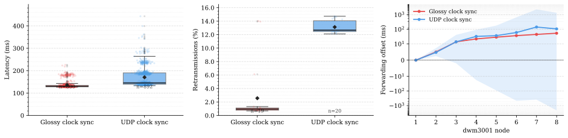
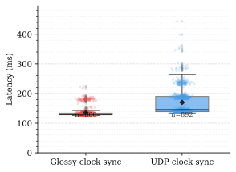
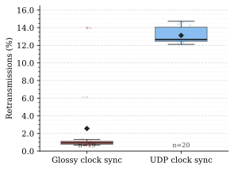
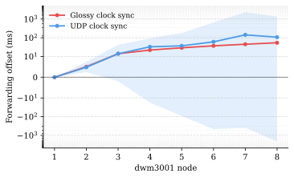
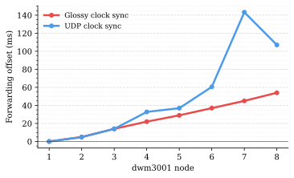
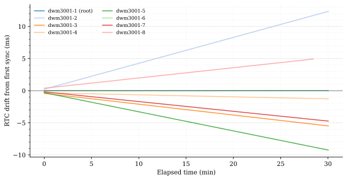

# Glossy vs. UDP Clock Sync Delay-Chain Experiment

This folder contains one comparison run for the DWM3001 delay-chain example.
The experiment sends timestamp messages through the same chain of federates and
compares two clock-synchronization approaches:

- `glossyrun.txt`: delay chain using Glossy-based clock synchronization.
- `udprun.txt`: delay chain using UDP/IP-based PTP-ish clock synchronization.

The chain logs end-to-end latency at `dwm3001-1`, per-hop forwarding offsets
from the intermediate federates, and RUDP retransmission statistics. The helper
script `glossy-vs-udp-plot.py` extracts those measurements and generates the
figures below.

Regenerate the plots with:

```sh
python3 glossy-vs-udp-plot.py
```

## Combined Overview

`glossy-vs-udp.svg` combines the main latency, retransmission, and hop-offset
views in one figure.



## End-to-End Latency

The latency box plot uses all lines of the form `Latency: ... ms`. In this run,
Glossy clock synchronization produces lower median latency and a tighter spread.



## RUDP Retransmissions

Retransmissions are extracted from RUDP `[stat] ... packets sent, ...
retransmissions` lines and plotted as a percentage of packets sent. The UDP
clock-sync run shows substantially higher retransmission pressure.



## Hop Offsets

Forwarding offsets are extracted from lines such as `Forwarding message (offset
5.00 ms)`. Only `dwm3001-1` through `dwm3001-8` are shown; `dwm3001-15` and
`dwm3001-16` also logged values but are outside the contiguous first chain.

The symmetric-log plot keeps both negative offsets and large UDP excursions
visible.



The linear trend plot shows only the central trend line, currently the median
per node. This makes the nearly linear Glossy hop-to-hop behavior easier to
inspect.



## Glossy RTC Drift

`glossy-rtc-offset-plot.py` extracts the Glossy `rtc_offset=... ms` reports and
plots their development over elapsed log time. `dwm3001-1` is the Glossy root
and reference device, so all other offsets are relative to it. The first
reported offset for each device is treated as the constant startup offset and
subtracted from that device's later measurements, so the plot shows drift from
the first sync rather than absolute clock offset.

Regenerate this plot with:

```sh
python3 glossy-rtc-offset-plot.py
```


