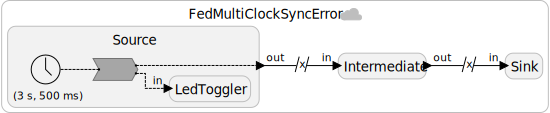
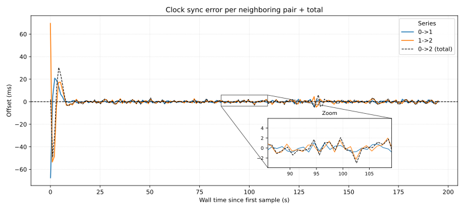
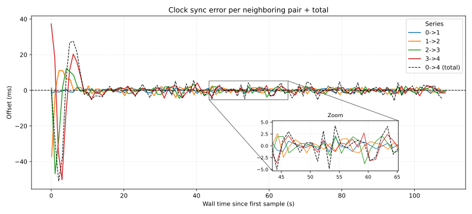
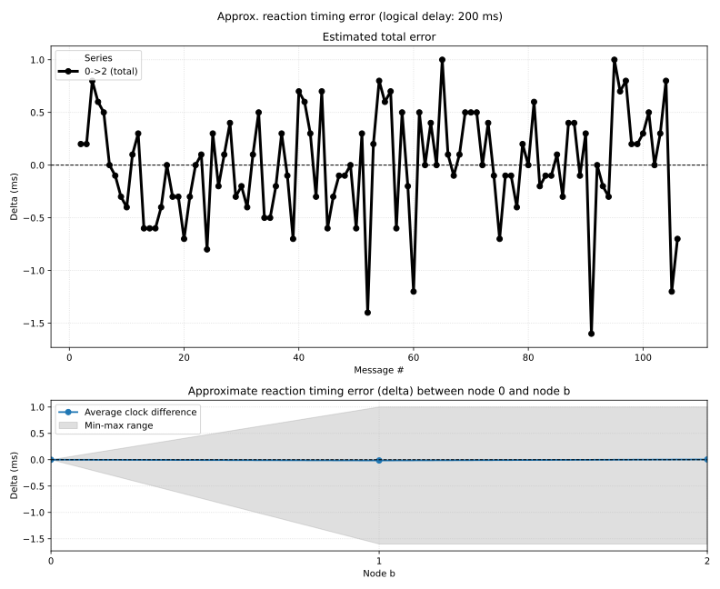
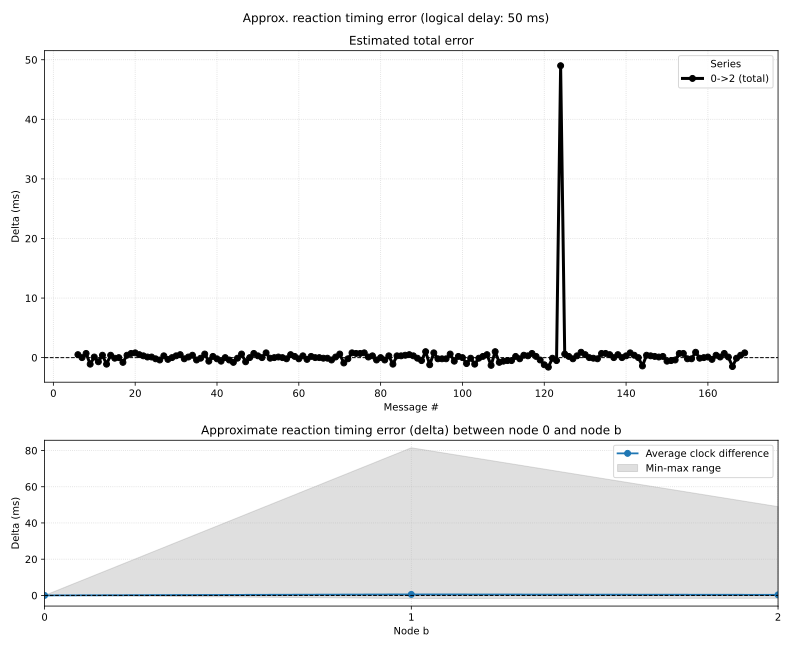

Evaluates multi-hop transmission delays and clock synchronization errors. The programs are an extension of the `FedDelay` and `FedClockSync` experiments in that we have one sequence of federates (source, intermediate, sink) instead of two federates (source, sink).

# Setup

- `3001CDK` for all federates (`hailo-desktop`)
- Power supply: USB connection (Raspberry PI)

We evaluate programs of the following shape (example for `n=3` federates):

<p align="center">
  
</p>
<p align="center">
  <span style="display:inline-block; width:49%;"><em>Figure 1: Program for n=3.</em></span>
</p>

# Experiment: Evaluating reported PTP offsets

In this experiment, we evaluate the reported PTP offsets of the federates. The PTP offset is the difference between the local clock of a federate and the reference clock (e.g., the PTP master). By analyzing the reported PTP offsets, we can estimate the clock synchronization accuracy and stability of the federates over time.

<p align="center">
  
</p>
<p align="center">
  <span style="display:inline-block; width:49%;"><em>Figure 2: Reported PTP offsets for n=3.</em></span>
</p>

<p align="center">
  
</p>
<p align="center">
  <span style="display:inline-block; width:49%;"><em>Figure 3: Reported PTP offsets for n=5.</em></span>
</p>

# Experiment: Evaluating multi-hop clock sync / reaction invocation timing errors based on physical timestamp output

For evaluation, instead of using the oscilloscope setup, we just look at the physical timestamps of the events in the log files. This only gives a rough estimate because the reported physical times are not perfectly accurate.

## Logging and Parsing

The logging format is expected to be
```
[<device-name>] [<FEDERATE_ID>] Value <value> at physical time <timestamp> ms and logical time <logical_time> ms
```
where
  - `<device-name> :: String` is the name of the device (e.g., `hailo-desktop:dwm3001cdk-9`) (optional!),
  - `<FEDERATE_ID> :: Int` is the respective federate id,
  - `<value> :: Int` is the value of the event,
  - `<timestamp> :: Float` is the physical time when the event was processed (in ms), and
  - `<logical_time> :: Int` is the logical time of the event (in ms). By comparing the physical timestamps of events across the source, intermediate, and sink federates, we can estimate transmission delays and clock synchronization errors.

Furthermore, in order to support the `iot-lab` serial aggregation, we ignore and drop any log line prefixes that end in `;`.

## Evaluation: Reaction invocation delay based on physical timestamp output

<p align="center">
  
  
</p>

<p align="center">
  <span style="display:inline-block; width:49%;"><em>(a) 1 Hz (Saclay, logical 200 ms).</em></span>
  <span style="display:inline-block; width:49%;"><em>(b) 4 Hz setup (Saclay, logical 50ms).</em></span>
</p>
<p align="center">
  <span style="display:inline-block; width:49%;"><em>Figure 2: Reaction invocation delay for n=3.</em></span>
</p>

In the 4-Hz-example, we can see one outlier with a total delay of around 50ms. This is because the smaller logical delay of 50ms is not sufficient to "absorb" the transmission delay in case of a TCP retransmission. In the 1-Hz-example, the logical delay of 200ms would be sufficient to absorb the (rare) transmission delay, and we do not see any outliers. In fact, in the 1-Hz-example, actually no TCP retransmissions occurred, so the outcome would have been the same with a smaller logical delay.