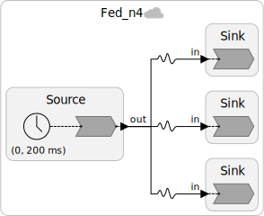
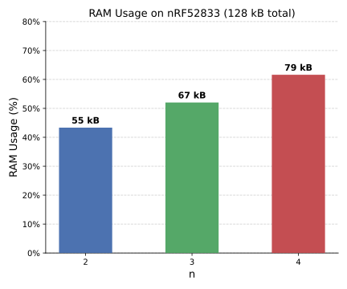

## Experiment: Program Size

Consider the following program, which consists of a single reactor that outputs an integer:

	

The RAM usage increases proportionally to the number of federates connected to the specific reactor. Thus, for the `Sink` reactors, the RAM usage is quite low, while for the `Source` reactor (the central reactor), the RAM usage is quite high. The following chart shows the RAM usage of the `Source` reactor as a function of the number of federates connected to it:

	

