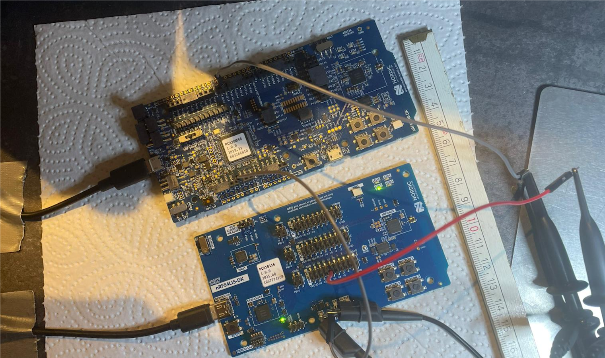
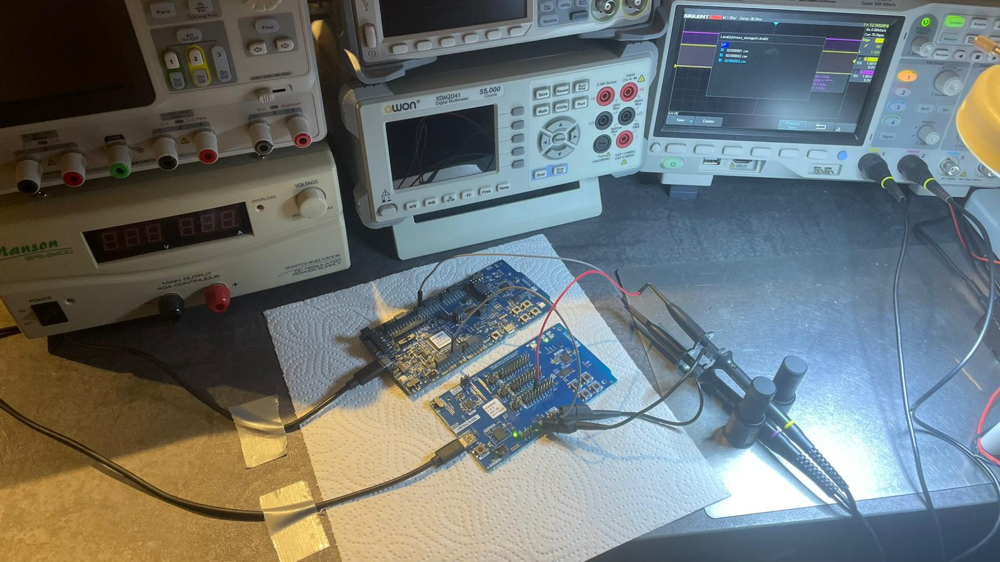
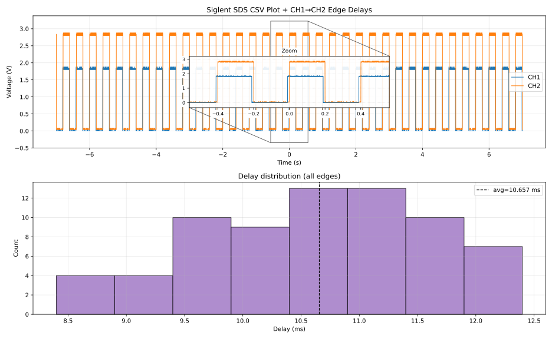
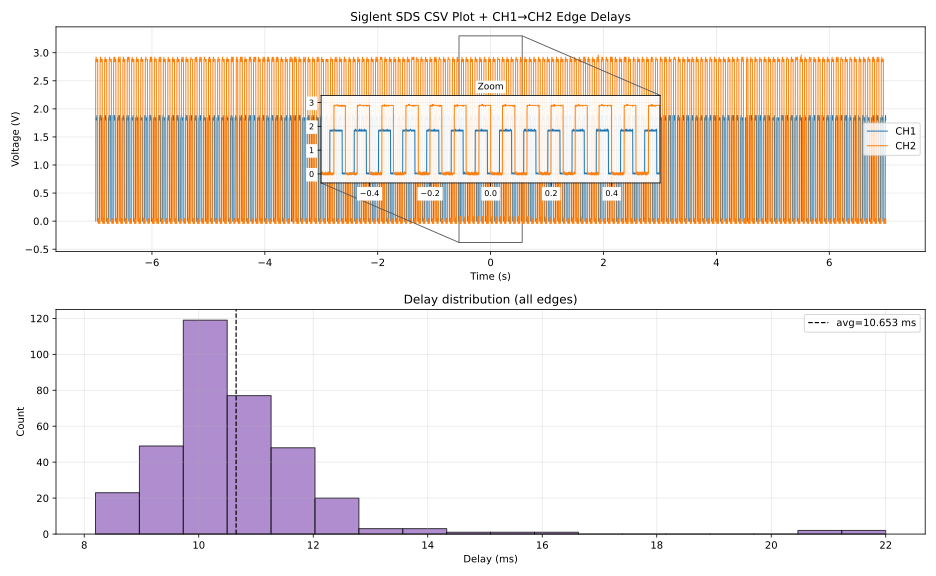
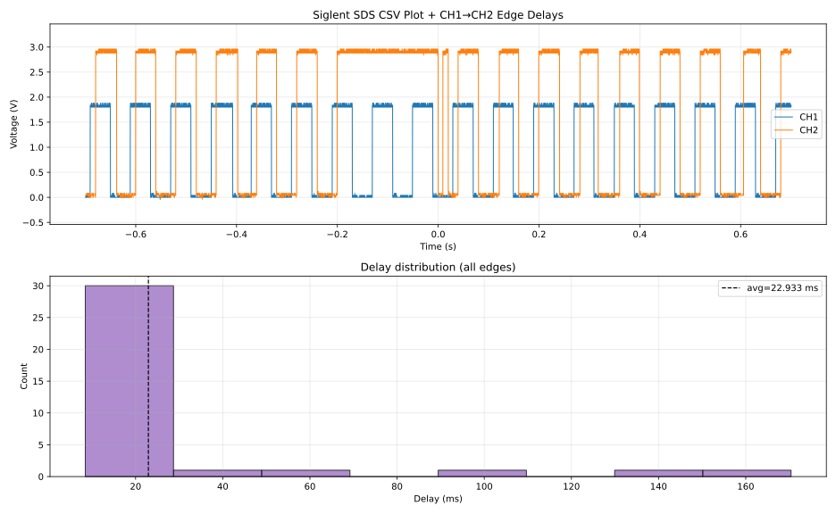
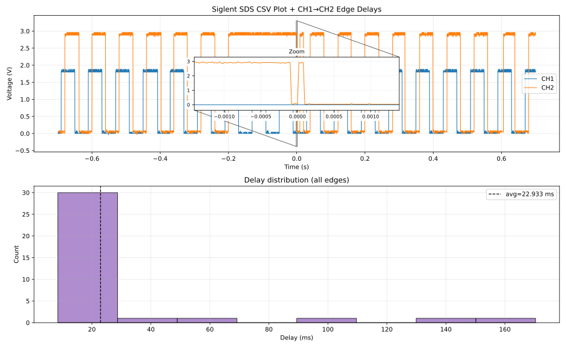
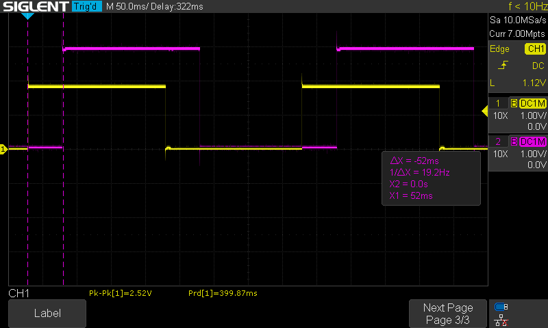

# Setup

- `nRF54L15DK`: Source
- `nRF52840DK`: Sink
- Power supply: USB connection (Laptop)

If not stated otherwise, all traces have a duration of exactly 14 seconds.

A memory depth of 70k is usually reasonable for a trace of 14s, but keep in mind that if data is lost and packets are received too late (TCP retransmission), the packets might "dam up", resuling in the LED toggling reaction being invoked in quick succession. These events cannot usually be captured with 70k memory depth (see `25Hz-VeryFastSuccession.csv`). In order to capture these events, unfortunately, 700k memory depth must be chosen.

  
  

Additional info: Almost no logging (`logging: warn`), only inspecting the `CLOCK_SYNC` offset of one device (logging on both).

## Experiment: FedDelay

The federation `src/FedDelay` consists of a physical connectinon between two federates. One federate (source) emits an untagged event and toggles his LED, and the other federate receives the event and processes it as soon as possible, toggling his LED. The measured delay between these LED toggles indicates the complete processing and transmission delay, including scheduling overhead etc.

The program is as follows:

	

### 5Hz vs 25Hz communication rate

The left view uses a `200ms` period (5Hz), the right view uses a `40ms` period (25Hz).

  
  

also consider

  
  

## Experiment: FedClockSync

In this experiment, we use a logical delay that exceeds the maximum transmission delay determined in experiment `FedDelay`. The logical delay will "absorb" the transmission delay and after evaluating the end-to-end delay and subtracting the known logical delay, the remaining value reflects clock
synchronization error.

The program is as follows:

	

The resulting clock sync error distribution is:

	

Scope view:

	

