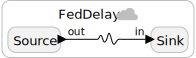
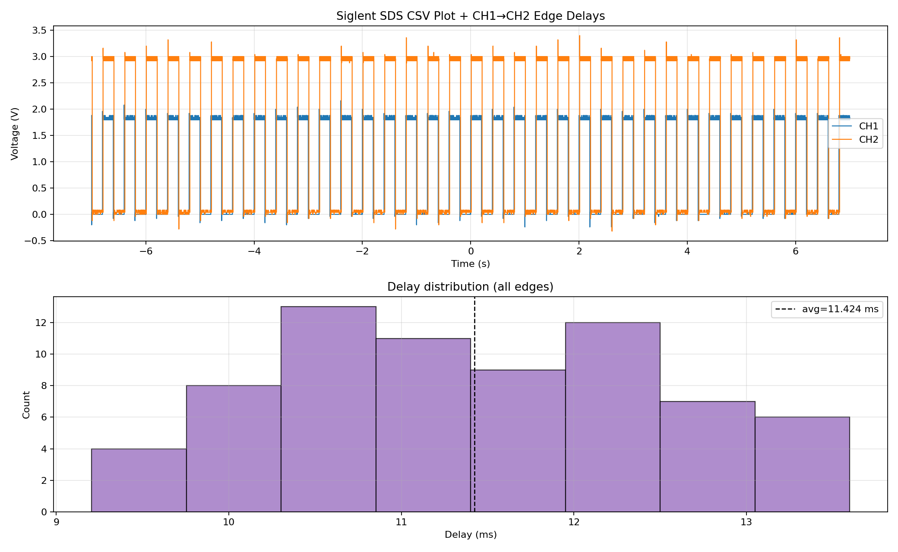
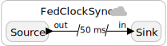
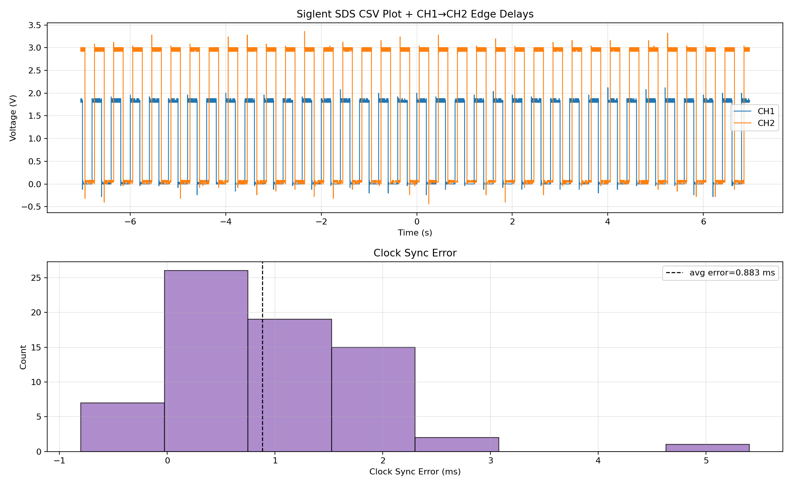

Setup:
- nRF54L15DK: Source
- nRF52840DK: Sink
- Power supply: USB connection (Laptop)

If not stated otherwise, all traces have a duration of exactly 14 seconds.

## Experiment: FedDelay

The federation `src/FedDelay` consists of a physical connectinon between two federates. One federate (source) emits an untagged event and toggles his LED, and the other federate receives the event and processes it as soon as possible, toggling his LED. The measured delay between these LED toggles indicates the complete processing and transmission delay, including scheduling overhead etc.

### 5Hz communication rate

The program is as follows:

	

Output: 

	

### 25Hz communication rate

The program is similar to the one above, but with `40ms` period instead of `200ms`. Output:

	

## Experiment: FedClockSync

In this experiment, we use a logical delay that exceeds the maximum transmission delay determined in experiment `FedDelay`. The logical delay will "absorb" the transmission delay and after evaluating the end-to-end delay and subtracting the known logical delay, the remaining value reflects clock
synchronization error.

The program is as follows:

	

The result clock sync error distribution is:

	

