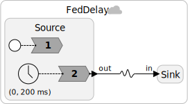
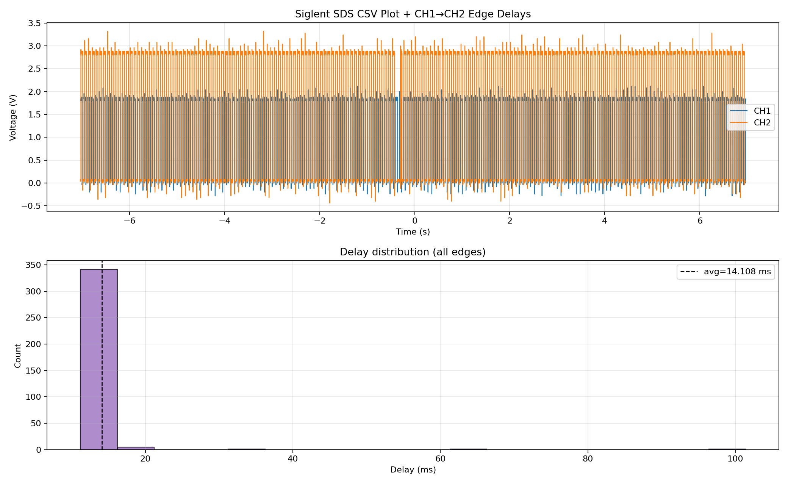

Setup:
- nRF54L15DK: Source
- nRF52840DK: Sink
- Power supply: USB connection (Laptop)

## Experiment: FedDelay

The federation `src/FedDelay` consists of a physical connectinon between two federates. One federate (source) emits an untagged event and toggles his LED, and the other federate receives the event and processes it as soon as possible, toggling his LED. The measured delay between these LED toggles indicates the complete processing and transmission delay, including scheduling overhead etc.

### 5Hz communication rate

The program is as follows:

	

Output: 

	

### 25Hz communication rate

The program is similar to the one above, but with 40ms period instead of 200ms. Output:

	

